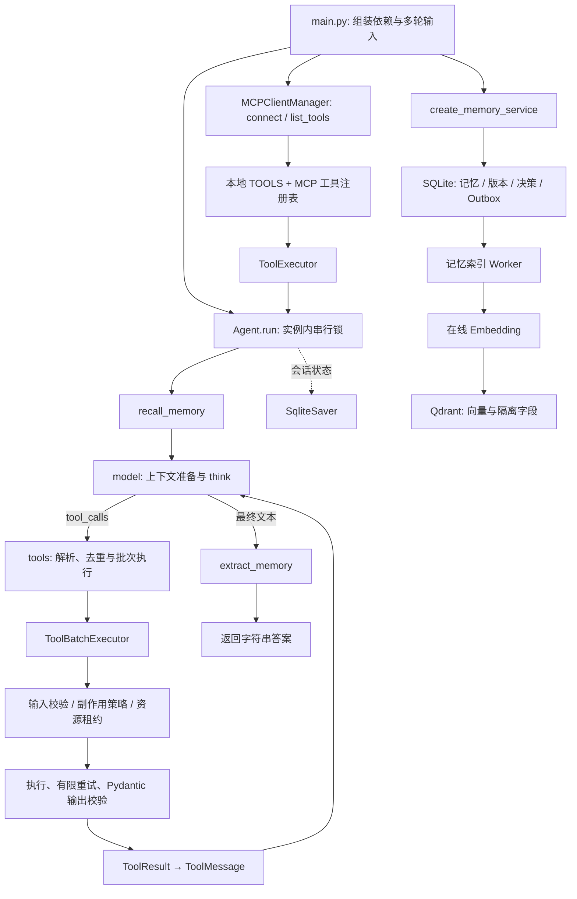

# 现有 Agent 框架能力评估

评估日期：2026-10-09（Asia/Shanghai）  
需求依据：根目录 `AI_MEDIA_AGENT_PROJECT_SPEC.md` v1.0  
评估范围：当前工作区代码、依赖、配置入口和本地测试；这是阶段 0 的交付，不代表自媒体业务已经实现。

后续进度：阶段 1A 已独立交付，见 [PHASE_1A_STORAGE.md](PHASE_1A_STORAGE.md)。下文保留阶段 0 的原始审计基线，新增业务能力以阶段交付说明为准。

## 1. 结论与实施边界

当前仓库是可运行的 Python Agent 框架，具备 LangGraph 执行循环、原生 Tool Calling、MCP 客户端、工具校验与有限重试、资源感知并行、上下文压缩、SQLite 会话检查点，以及 SQLite + Qdrant 长期记忆。已有能力足以承载自媒体 MVP，**不需要重写 Agent，也不需要迁移现有目录或替换技术栈**。

主要缺口位于应用与业务层：账号/策略、结构化研究资料、选题与文案版本、审核、业务 Run/Task 状态、产物与事件持久化、API 和工作台。当前没有独立的任务规划器、业务 DAG 调度器、运营调度器或内容审核器。

建议新增 `media_operations/`、`apps/api/`、`apps/web/`，通过适配器调用已有 `Agent` 和 `ToolExecutor`。MVP 使用独立 SQLite 业务库和受控本地产物目录，保留原有记忆库、检查点库与命令行入口。长期记忆先关闭，账号规则每次从业务库加载；后续再接入已有记忆服务。

第一阶段优先链路：**账号定位 → 热点/资料调研 → 选题规划 → 内容生成 → 规则与 LLM 审核 → 保存版本、来源、执行记录和 Markdown → 最小人工审核**。

## 2. 已核实的技术与代码基线

| 项目 | 当前事实 | 对实施的影响 |
| --- | --- | --- |
| Python | `pyproject.toml` 要求 >=3.12；本地虚拟环境 3.12.13 | 沿用 Python，不引入第二套后端 |
| 模型/编排 | LangChain 1.4.2、langchain-deepseek 1.1.1、LangGraph 1.2.12 | 复用模型注入与状态图 |
| 会话持久化 | langgraph-checkpoint-sqlite 3.1.1 | 保留会话检查点职责 |
| 校验 | Pydantic 2.13.5 | 新增领域输入输出模型 |
| MCP | FastMCP 4.0.10 的 Client | 已有客户端，不必另建 MCP 运行框架 |
| 向量检索 | qdrant-client 1.19.1，Compose 仅部署 Qdrant | 记忆已有；业务 RAG 尚未实现 |
| 数据访问 | 标准库 `sqlite3`，没有业务 ORM/迁移体系 | MVP 延续 SQLite + Repository，新增版本化业务迁移 |
| 应用入口 | `main.py` 多轮命令行；没有 API 服务或前端源码 | 新增独立入口，避免改写聊天入口 |
| 测试 | `unittest`；没有项目级 pytest/CI 配置 | 沿用测试方式，后续建立可复现 CI |

工作区已有未提交修改，涉及 README、Agent、上下文、入口、测试和 `.gitignore`；需求文档也尚未跟踪。本次按工作区实际代码评估，不覆盖这些修改，不执行回滚。本次只新增两份规划文档。

未发现适用的 `AGENTS.md`。`LANGCHAIN_MIGRATION.md` 是迁移历史说明，当前架构以代码和运行测试为准。

## 3. 现有调用链



关键边界：

- `Agent.run()` 返回最终字符串；`AgentState` 是 `TypedDict`，不是自媒体产物模型。
- `runtime.py::_build_graph()` 是固定的记忆召回 → 模型/工具循环 → 记忆提取图。LLM 可以临场决定工具调用，但没有持久化的业务计划、任务依赖和阶段结果。
- `tooling/scheduler.py` 调度同一批 `tool_calls`，不负责“每周运行”、跨阶段任务依赖或跨进程任务领取。
- `SqliteSaver` 支持会话恢复；公开 `run()` 会创建新用户轮次，并非运营任务恢复 API。不能把聊天检查点等同于可恢复的业务 Run。
- `agent/memory/worker.py` 处理记忆索引 Outbox，不是内容生产 Worker，不能直接改成运营任务队列。

## 4. 框架能力与复用判断

“直接复用”指接口和机制可用，并不表示对应自媒体业务已完成。

| 能力 | 实现证据 | 复用判断 | 缺口/扩展位置 |
| --- | --- | --- | --- |
| Agent Runtime | `agent/runtime.py::Agent`、`AgentState`、`_build_graph`、`run` | 直接复用 | 领域适配器调用；不把平台规则写入核心 `SYSTEM` |
| 模型调用/角色配置 | `Agent(system=..., chat_model=..., tool_executor=...)`、`think`、`bind_tools` | 直接复用 | Research/Planning/Content/Review 使用领域提示词、阶段工具白名单和独立实例 |
| 执行限制 | 默认 `max_steps=8`、`max_model_recoveries=2`、图递归限制；模型 timeout=60、max_retries=0 | 直接复用并补业务预算 | 步数不是 Run Token/金额/总时长上限；新增共享预算和截止时间 |
| 截断检测 | `_check_model_output` 拦截供应商 length/max_tokens 等结束原因 | 直接复用 | 领域结果另做 Schema 校验；不可将部分 JSON 视为成功 |
| 工具抽象/注册 | `Tool`、`RetryPolicy`、实例 `registry`、`get_tool_schemas` | 直接复用 | 业务工具以局部字典组装，避免全局注册表污染 |
| 工具输入校验 | `validate_tool_arguments` 校验必填、标量类型、部分范围/长度 | 需要领域增强 | 不完整支持嵌套、数组、enum、`$ref` 等；新工具入口显式执行 Pydantic 校验 |
| 工具输出校验 | `ToolExecutor::_execute_with_retry` 调用 `output_model.model_validate` | 直接复用 | 为来源、选题、保存产物等定义具体模型 |
| 统一错误与重试 | `tooling/result.py`、`errors.py`、`executor.py` | 直接复用 | 保留 `ok/value/error` 契约，业务层映射 sources/metadata；不要替换核心信封 |
| 工具超时 | 搜索 20 秒、网页 15 秒、MCP 配置超时 | 部分复用 | 执行器直接调用工具，不能强制中止任意 Python 函数；Task 硬超时需要执行隔离 |
| 批次并行/资源锁 | `ToolBatchExecutor` 默认 4 并行；`ResourceLockManager` READ/WRITE/EXCLUSIVE | 直接复用 | 仅进程内锁；业务库靠事务和唯一约束防重复写，不依赖此锁实现分布式一致性 |
| 副作用策略 | `SideEffectLevel`、`ToolExecutionPolicy.evaluate`，外部/破坏性写默认审批 | 直接复用拦截能力 | 无审批请求持久化、授权票据或暂停恢复；审批错误当前导致 Agent 终止 |
| MCP 客户端 | `integrations/mcp.py` 发现、命名空间、持久 Client、协议错误归一化 | 直接复用 | `MCPToolOutput` 为 `RootModel[Any]`，没有领域语义校验；默认 RetryPolicy 只有 1 次 |
| 外部搜索 | `tooling/registry.py::web_search` 调用博查 | 复用供应商接入，新增结构化适配 | 结果为拼接文本，freshness 固定 `noLimit`，未保留可靠发布时间；不是平台热榜 |
| 网页正文 | `read_webpage`、公共 IP 校验、重定向复验、HTML 文本抽取 | 复用基本机制，新增领域读取器 | 无结构化标题/最终 URL/发布时间/抓取时间/摘要哈希，DNS 校验与连接存在时间差 |
| 文件工具 | `create_file/write_file/read_file` 工作区边界、偏移分页和资源声明 | 复用路径安全思路 | 工作区范围过宽，能访问 `.env` 等业务不需要的文件；不可原样暴露给业务 Agent |
| 上下文工程 | `agent/context.py` 分区预算、会话摘要、工具回合压缩、协议配对 | 直接复用 | Token 计数是近似值；不能代替供应商实际 usage 或业务持久状态 |
| 工具结果摘要 | `agent/summarizer.py::ResultSummarizer` 无工具摘要请求、失败回退 | 直接复用机制 | 文本摘要未全部 Pydantic 化，不保证来源 ID 保留；原始来源先保存，业务数据再摘要 |
| 长期记忆 | `models/repository/service/extractor/reconciliation/resolver` | 第三阶段复用 | 已有候选、证据、去重、版本和事务；不是知识文档分块/RAG 管线 |
| 遗忘与隔离 | `forgetting/forget_repository/forget_tools`；tenant/user/project 过滤、来源序号与写入门禁 | 保留、后续接入 | 当前不是原生 account 隔离；普通召回可混入用户全局记忆，接入前需明确账号边界 |
| 日志与可观测性 | logging 输出 Action/Observation/错误/最终答案；ToolResult 有耗时和尝试数 | 部分复用 | 无业务关联 ID、持久事件、Run 成本汇总、SSE；不能靠解析中文日志建立业务记录 |
| 配置与部署 | `load_env`、环境变量、`compose.yaml` | 复用基础 | 新业务 Settings、`.env.example`、API/Web 启动及生产部署待建 |
| Planner / Task DAG | 无对应业务实现 | 新建业务层 | 固定工作流模板 + 结构化 Coordinator 计划，避免开发通用规划框架 |
| Review/Reflection | 只有工具纠错/记忆冲突判断 | 新建业务层 | 工具纠错不等于内容事实、风格和引用审核 |

## 5. 对需求模块的逐项判断

| 需求模块 | 当前覆盖 | 第一阶段处理 | 后续处理 |
| --- | --- | --- | --- |
| 账号档案/内容策略 | 没有业务实体；记忆可保存稳定偏好 | 新建账号、目标、策略版本及 Run 配置快照 | 策略建议审批和效果追踪 |
| Coordinator 与任务计划 | 通用 Agent 可决策工具，未持久化计划 | 生成受约束 `MediaTaskPlan`，代码校验后映射固定任务模板 | 动态 DAG 与并行研究 |
| 热点/资料调研 | 博查、网页和 DeepWiki 接入可用 | 结构化检索、抽取、来源验证，区分热点证据与常青材料 | 更多授权数据源、研究缓存 |
| 账号知识检索 | 分页文件读取和记忆检索已有 | 受控账号 Markdown 知识目录，关键词检索，保留路径/哈希 | 文档导入、分块、独立 Qdrant 知识集合 |
| 选题池/周计划 | 无 | 候选、四维评分与理由、来源、计划和基础去重 | 语义去重、内容日历 |
| 内容生成 | Agent 可输出自由文本 | 具体 `ContentDraft`，平台文案规则、版本与引用 | 多平台和图片辅助 |
| 机器审核/修订 | 无内容审核节点 | 规则 + LLM 审核，最多两次修订，问题/证据可查 | 人工反馈学习与评测集 |
| 人工审核 | 策略只能阻断高风险工具 | 最小通过/驳回/编辑接口，审批绑定草稿版本 | 更完整审批中心与通知 |
| 保存/导出 | 通用文件写入已有 | 业务事务保存，确定性 Markdown 导出、哈希和结果索引 | 对象存储 |
| Run/Task/ToolCall 记录 | 会话 State、ToolResult、控制台日志 | 独立业务表、任务依赖、事件序号、失败状态 | 租约恢复、SSE 和周期去重 |
| 发布与指标 | 无 | MVP 保存待人工确认草稿 | 人工发布回填 → CSV 指标 → 复盘 → 经验证的平台适配 |
| Web/API | 无 | FastAPI 最小接口与精简工作台 | 日历、报表、知识/记忆管理 |

## 6. 优先处理的风险与限制

1. **结构化契约不完整。** 现有最终回答是文本；工具输入是手工 JSON Schema 子集；MCP 输出是 Any。领域层必须校验所有业务 LLM 输出及工具输入输出；不能把“模型说已保存”作为成功。摘要/记忆等模型调用也要计入预算，业务摘要需经结构化模型验证。
2. **来源与时效不足。** 搜索 URL 是发现线索，不自动证明热点或事实。保存抓取快照、时间和引用片段，缺失发布时间用 null。搜索为空或认证失败时明确记录无法检索，不编造趋势、热度和引用。
3. **不可信内容隔离仍需验证。** 系统提示已声明工具/摘要/记忆不可信；部分记忆与摘要用带 `untrusted_data` 标记的 SystemMessage 包装。这属于提示与元数据治理，不是强隔离保证。新业务阶段使用工具白名单、独立证据区和程序引用检查，建立网页注入测试；不能声称已有安全测试覆盖完整业务链。
4. **日志脱敏存在缺口。** 正常 Action 格式会隐藏部分敏感字段及大 content，但非法调用路径可能打印原始参数，Observation、最终文本及异常未统一脱敏。新应用入口加脱敏过滤器、审计模型和测试；不直接记录 HTTP 头、密钥或网页全文。
5. **文件与网络权限过宽。** 通用文件工具只限制工作区，未限制知识/产物目录；URL 公共 IP 检查仍有 DNS 重绑定等边界。业务侧不提供任意文件路径工具，采用受控目录、网络域名/端口策略与每次重定向复验。当前网页提取有大小限制，但没有完整正文完整性标记。
6. **任务恢复与取消尚未实现。** 线程不能可靠硬取消同步函数，进程内资源锁不跨 Worker 生效。MVP 用单 Worker + 子进程执行边界，截止时间内协作取消、超时终止隔离进程；业务结果仅由控制器验证提交。第一版中断任务标记失败并允许显式重跑，第二阶段才加入自动恢复。
7. **审批拦截不等于审批流程。** 现有 `approval_required` 会终止 Agent，没有持久化 `WAITING_APPROVAL`。MVP 的内容人工审批由业务控制器管理；发布工具不注册。未来外部写审批必须绑定动作、参数摘要、账号与版本，不能按副作用等级整体放行。
8. **记忆不能替代业务真相。** 账号规则和内容版本以业务库为准，MVP 不自动提取运营结论。第三阶段必须验证账号隔离，避免用户全局记忆跨账号召回；知识库与记忆使用不同数据管线。
9. **测试可复现性需补齐。** `.gitignore` 的 `/tests/*` 规则会忽略新测试；当前 `test_tools.py`、`test_tool_result.py` 已被忽略，部分本次运行测试不在 Git 跟踪中。后续以最小修改解除测试源码忽略，保留缓存忽略；在干净检出上再验证基线。

## 7. 本次验证及外部依赖状态

本次执行：

```powershell
.\.venv\Scripts\python.exe -m unittest discover -s tests -v
```

结果：**145 项测试全部通过，测试报告用时 7.692 秒，无失败/错误**。覆盖 Agent 原生工具调用、工具纠错/重试、MCP 错误分类与适配、策略拦截、并行资源锁、文件分页与路径边界、输出模型、上下文预算/压缩、会话检查点、记忆索引/冲突/遗忘与隔离。测试采用 mock/脚本模型、本地临时文件/数据库等，不等于真实联网或自媒体业务验收。本轮没有新增实现测试。

仅检查配置是否存在，未展示密钥：DeepSeek、博查、专用 Embedding Key 均有非空配置；不据此判断密钥有效或接口有权限。`DASHSCOPE_API_KEY` 未设置，但专用 Embedding Key 已配置；`QDRANT_API_KEY` 未设置，对本地无鉴权实例不构成缺失。未进行真实模型、博查、DeepWiki、Embedding、Qdrant 或发布平台连通性验证，也未执行可能产生费用的内容生产。

## 8. 拟新增/修改文件与核心影响

| 范围 | 计划文件 | 原因与影响 |
| --- | --- | --- |
| 领域契约 | `media_operations/schemas.py`、`ports.py`、`config.py` | 业务模型、可替换的运行/研究/存储接口、预算配置 |
| 业务编排 | `media_operations/workflow.py`、`manager.py`、`stages/`、`prompts/` | 固定流程、有限修订、任务与人工审核状态；不修改通用图 |
| 框架适配 | `media_operations/adapters/agent_runtime.py`、`model_usage.py`、`tool_executor.py` | 使用公开构造参数、模型注入与执行器扩展收集结果、预算和轨迹 |
| 研究与保存 | `media_operations/adapters/search.py`、`web_extract.py`、`knowledge.py`、`artifacts.py`、`tools.py` | 保留现有工具语义，新增有来源契约的领域工具和受控路径 |
| 业务持久化 | `media_operations/persistence/`、`migrations/` | 新业务库、事务、迁移、Run/Task/来源/版本/事件 |
| 入口 | `apps/api/`、`apps/web/`、`media_operations/worker.py` | API、单 Worker 与最小工作台；保留 `main.py` |
| 配套 | `tests/test_media_*.py`、`data/samples/`、`data/evaluations/` | 离线闭环、来源与失败样本、业务集成测试 |
| 现有文件 | `pyproject.toml`、`uv.lock`、`.gitignore`、`README.md` | 声明 API 依赖、跟踪测试、新入口文档；逐项合并当前未提交修改 |
| 后续部署 | `.env.example`、`compose.yaml`、架构/设计/工作流文档 | 从最小本地启动逐步完善交付 |

**阶段 1 默认不修改 `agent/runtime.py`、`agent/context.py`、`tooling/`、`integrations/mcp.py` 或现有记忆表。** 若公开注入接口无法覆盖模型用量或工具轨迹，先在业务适配器实现；只有出现已验证的阻碍才考虑通用扩展点。届时需单独记录原因、影响、替代方案和回归测试，扩展点不得引入账号/平台概念。下一步具体任务、迁移、接口与验收见 [IMPLEMENTATION_PLAN.md](IMPLEMENTATION_PLAN.md)。
