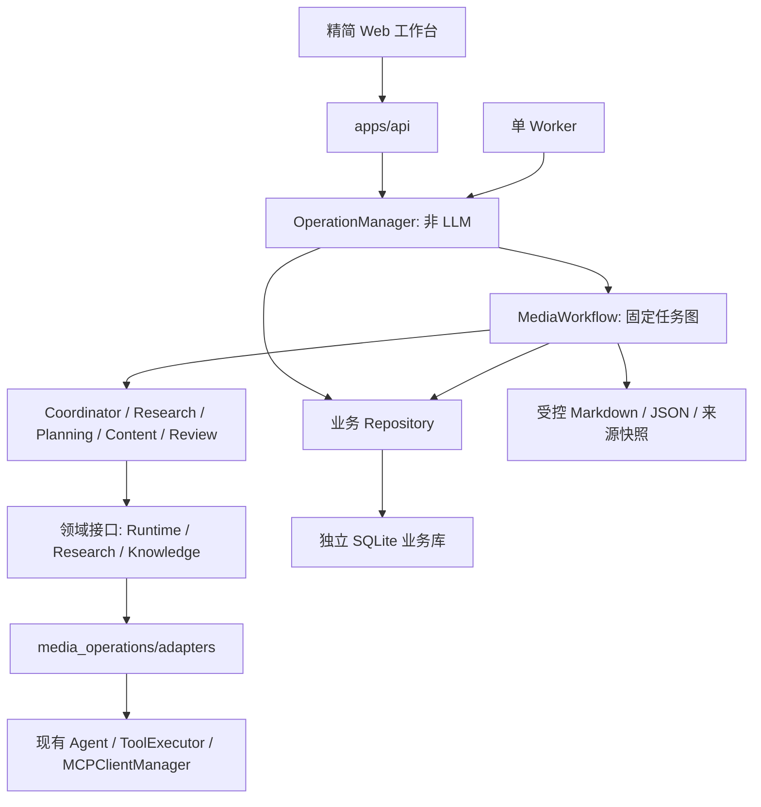

# 自媒体自主运营系统分阶段实施计划

规划日期：2026-10-09（Asia/Shanghai）  
依据：`AI_MEDIA_AGENT_PROJECT_SPEC.md` v1.0、[现有框架能力评估](EXISTING_FRAMEWORK_ASSESSMENT.md)  
当前阶段：阶段 0、1A 和 1B 已完成。已实现独立业务存储，以及结构化搜索/网页/账号知识工具、来源快照和工具轨迹；1C–1E 和后续阶段尚未实现。具体交付见 [PHASE_1A_STORAGE.md](PHASE_1A_STORAGE.md) 和 [PHASE_1B_RESEARCH.md](PHASE_1B_RESEARCH.md)。1B 已完成离线验证，真实供应商 smoke 尚待执行。

## 1. 实施决策与范围

1. 保留现有 `agent/`、`tooling/`、`integrations/`、`main.py`，新增独立 `media_operations/` 业务包。业务层依赖框架适配器，核心框架不反向依赖自媒体业务。
2. 复用现有 `Agent` 进行需要自主检索或推理的工作。Coordinator、选题、内容、审核是业务阶段，不要求每个阶段成为长期存活的独立 Agent；规则检查、状态转换和保存由代码负责。
3. 第一阶段使用固定、可校验的顺序任务图，Coordinator 在模板内生成具体研究问题与内容计划，不实现通用动态 DAG 框架。已有 `ToolBatchExecutor` 继续处理阶段内部的独立工具调用。
4. 使用独立 SQLite 业务库 `.agent_data/media_operations.sqlite3` 和本地产物目录 `.agent_data/media_artifacts/`。不迁移现有记忆/检查点库，不引入 PostgreSQL、Redis、Celery 或新 ORM；有多实例/负载需求时再评估。
5. 第一阶段是单用户、本地部署、单账号运行的最小闭环，但所有业务数据带 `account_id`，测试验证账号隔离。API 身份来自服务配置，不接受模型或请求任意指定租户。MVP 默认仅监听本机；远程多用户鉴权在强化阶段补齐。
6. 首个平台按需求采用小红书图文文案规则，但不宣称具备平台 API。平台规则是可配置的 `PlatformProfile`，保留后续适配边界。
7. MVP 每次至少生成 5 个候选选题，默认先生成 1 篇草稿，可配置为所选多篇；“每周 3 篇”是账号计划频率，不等于一次任务必须生成 3 篇。候选不足时报告原因，不用重复或无依据内容凑数。
8. MVP 包含最小人工审核，第二阶段扩展编辑/审批体验、周期调度、日历和发布记录。全程不自动发布、不自动采集账号指标。

## 2. 目标依赖与目录



业务模型和状态枚举不引用 LangGraph 消息类。适配器负责把业务输入转为 Agent 提示/工具、把最终输出转为 Pydantic 模型。代码只沿 `应用入口 → 业务 → 适配器 → 现有框架` 调用；Repository 不由 LLM 直接访问。

建议新增结构（实现时可合并小文件，保持职责边界）：

```text
media_operations/
  __init__.py
  config.py                  # MediaSettings、预算与平台配置
  schemas.py                 # 业务契约、状态、来源与审核模型
  ports.py                   # Runtime、研究、知识、存储、产物接口
  manager.py                 # Run 生命周期、取消、人工决策
  workflow.py                # 固定阶段与有限修订
  worker.py                  # 单 Worker、隔离执行与截止时间
  stages/                    # coordinator/research/planning/content/review
  prompts/                   # 领域提示词，不改核心 SYSTEM
  tools.py                   # 局部工具工厂、白名单
  adapters/
    agent_runtime.py         # 调用现有 Agent.run，不访问私有图节点
    model_usage.py           # 注入模型/回调，累计实际用量与限制
    tool_executor.py         # 基于现有执行器采集调用轨迹
    search.py                # 博查结构化适配
    web_extract.py           # 安全抽取与来源元数据
    knowledge.py             # 受控账号 Markdown 检索
    artifacts.py             # 确定性导出、原子文件提交
  persistence/
    repository.py
    migrate.py
    migrations/              # 按版本递增的 SQL
apps/api/                    # app.py、依赖组装、路由
apps/web/                    # Vue 3 + TypeScript，精简组件
data/samples/                # 账号配置和明确标注的示例材料
data/evaluations/            # 注入、来源缺失、事实错误等用例
tests/test_media_*.py
```

现有文件预期仅增补 `pyproject.toml`/`uv.lock`、`.gitignore`、`README.md` 和后续 `compose.yaml`；新增 `.env.example`。不搬迁现有文件。后端直接声明 `fastapi`、`uvicorn`，前端独立声明 Vue/Vite 依赖；测试继续使用 unittest。不依赖 FastMCP 间接安装的 API 包作为正式依赖。

## 3. 第一阶段 MVP 契约

### 3.1 Pydantic 模型

所有业务输入、业务 LLM 输出、工具输入/输出和持久化读取结果均以具体模型校验。默认禁止多余字段，枚举/长度/数量/分数范围显式约束；时间要求带时区，内部存 UTC，界面用 Asia/Shanghai。

| 模型 | 最小字段/约束 | 使用边界 |
| --- | --- | --- |
| `AccountBrief` | account_id、platform、account_name、positioning、target_audience、tone、content_pillars、publishing_frequency、banned_terms、version、status | 用户确认后入库；每次 Run 保存配置快照 |
| `ContentStrategy` | strategy_id、account_id、version、长期/周期目标、主题比例、quality_rules、rationale | 第一阶段由用户配置；模型建议不覆盖当前策略 |
| `MediaTaskPlan` | plan_version、研究问题、目标周期、候选数、产出数、平台、任务类型及依赖 | Coordinator 只能使用预定义类型；禁止循环、任意工具名和任意代码 |
| `ResearchQuery` | query、time_range、limit、intent（hotspot/evergreen） | 供搜索适配器严格校验 |
| `SourceReference` | source_id、original_url、final_url、title、published_at?、retrieved_at、snippet、content_hash、provenance、verification_status | source_id 由程序生成；发布时间未知为 null |
| `ResearchFinding` | finding_id、claim、source_ids、evidence_refs、confidence、limitations、freshness_reason | 引用必须属于当前账号可访问来源；结论有依据片段 |
| `TopicCandidate` | topic_id、title、pain_point、category、hotspot_or_evergreen、source_ids、四维 scores、score_reasons、duplicate_reason?、status | 评分范围 0–1；热点标签要求可核查时效依据 |
| `WeeklyPlan` | period_start/end、selected_topic_ids、频率、建议时间、selection_rationale | 选题 ID 必须在本次或账号历史池中，不凭空创造 |
| `ContentDraft` | 标题候选、摘要、正文、卡片大纲、标签、配图建议、引用与证据、平台、version | 文案长度由 PlatformProfile 约束，配图建议不是已生成图片 |
| `ReviewResult` | rule_passed、llm_passed、issues、严重级别、claim/evidence 对照、待核实点、revision_instructions | LLM 评价不作为事实已核实证明；严重问题阻止人工通过 |
| `AgentTaskResult[T]` | task_id、success、具体类型 data、error、source_ids、artifact_refs、usage、warnings | 每阶段只接受对应 T；成功/失败字段互斥 |
| `RunBudget` / `TaskError` | 调用/Token/时长/工具/金额限制；稳定 code、可重试性、阶段和安全消息 | 控制器统一限制、记录失败 |
| `HumanReviewDecision` | content_id、revision_id、expected_version、通过/驳回、理由、操作者 | 绑定具体版本并防并发覆盖 |

`PerformanceReport` 在第四阶段新增；第一阶段不生成无指标的复盘结果。`ToolResult` 保留现有 `ok/value/error`，不要为满足建议的 success/data 命名重写核心；业务接口可以映射为 `AgentTaskResult`。

### 3.2 如何复用 Agent 而不改内核

- `AgentRuntimeAdapter` 使用 `Agent(system=领域提示词, tool_executor=阶段执行器, chat_model=受预算模型, memory_service=None)`。不同阶段用独立实例/会话，避免角色提示与来源互相污染。
- 第一版要求最终回答为对应模型的 JSON，以 `model_validate_json()` 验证。失败只允许一次格式修正，修正阶段禁用网络/写工具，只传错误路径和已取得数据；不得重跑整个生产链。修正仍无效则 Task 失败。
- 研究阶段工具结果由适配器保存原始结构化结果与来源快照。模型输出的来源 ID 逐一与程序已取得来源交叉校验；模型不能自行制造“已抓取”的来源。
- 选题、创作和 LLM 审核优先只使用已取得材料。证据不足时由受限研究工具补查，或标记待核实；不能让模型无限自循环检索。
- 内容保存由控制器调用 Repository 和产物工具实现，工具返回的保存回执包含真实 artifact_id、路径和哈希。最终 LLM 文本不作为已落库证据。
- 模型调用用量通过注入模型及 LangChain 回调采集；工具轨迹通过执行器的公开 `prepare/execute_prepared` 扩展采集，包含校验/策略阶段拒绝和重试结果。不解析控制台日志，不调用私有 `_run/_model_node`。
- 现有摘要器如被使用，同样必须纳入预算；业务摘要适配器验证 `ContextDigest`，仅输出原材料中存在的 source/artifact ID。文案规则和证据检查使用完整存储记录，不使用压缩摘要作为唯一依据。

## 4. 第一阶段工具接口与安全边界

| 工具 | 结构化返回 | 复用/实现方式 |
| --- | --- | --- |
| `search_web(query, time_range?, limit?)` | 结果列表、来源和时间、provider、limitations | 复用博查服务与错误策略；读取供应商原始 JSON，保留字段。只有供应商支持且已验证时才映射时间过滤，否则注明限制 |
| `extract_web_page(url)` | SourceReference、正文引用、截断标记、标题/发布时间（可缺失） | 复用公开 HTTP/HTML 提取思路；新适配器补元数据、响应大小/时间限制和网络策略 |
| `search_account_knowledge(query, account_id)` | 受控 Markdown 文件片段、document/source ID、哈希 | account_id 由可信上下文绑定并校验；不接受任意系统路径，不暴露通用 read_file |
| `get_published_topics(account_id, time_window)` | 已发布内容的 ID/标题/主题/时间 | 从业务 Repository 查询；MVP 尚无发布数据时真实返回空，同时 Planning 查询近期候选和草稿防重复 |
| `save_markdown_artifact(run_id, title, content)` | artifact_id、相对路径、hash、bytes、status | 由控制器调用，固定根目录 + 程序 ID 命名；模型不能指定任意路径或覆盖其他 Run |

新工具内部调用 Pydantic 输入校验，不假定现有手工 Schema 校验器能处理嵌套规则。所有网络调用有限重试；只读搜索最多 3 次、网页最多 2 次；不得由外层无条件再重试整个 Agent。MCP 是可选研究补充，初期仅允许配置中明确可信的 DeepWiki 只读工具，并加领域结果校验；连接失败可继续本地工具链。

来源快照先落库/落文件，再向模型传有大小上限的片段与 ID。搜索摘要、正文和知识片段作为不可信数据，不能拼进系统指令。禁用任意工作区写入、shell、外部发布/评论/私信工具；入库与导出由可信代码执行。网络使用允许的协议/端口和域名策略，重定向重新验证，避免访问本机/内网；完整网络隔离能力作为后续部署加固项验证。

## 5. 第一阶段任务、审核和失败语义

### 5.1 任务链

```text
创建/确认 AccountBrief + ContentStrategy（保存版本）
  → 用户发起 Run（配置快照 + 幂等键 + 预算）
  → coordinator：输出受约束 MediaTaskPlan
  → research：检索/抽取/来源快照 → ResearchFinding[]
  → planning：近期候选/草稿/已发布主题去重 → >=5 个候选 + WeeklyPlan
  → content：为选中选题生成 ContentDraft
  → review：确定性规则 + LLM 证据/专业性/风格审核
      → 不通过：最多 2 次 content 修订 → 再审核
      → 通过：保存待人工确认草稿
  → persist/export：内容版本、审核、JSON/Markdown、运行报告
  → WAITING_APPROVAL：用户查看、编辑、通过或驳回
```

Coordinator 计划只能映射到上述模板，不由 LLM 决定是否绕过 review/persist。第一阶段跨任务串行执行，研究内部独立工具调用可使用已有批次并行。所有阶段结果保存后才推进依赖；每篇草稿有独立 Task 与 revision 引用。

### 5.2 状态规则

- Run：`PENDING → RUNNING → WAITING_APPROVAL → COMPLETED`；技术失败进入 `FAILED`，用户取消进入 `CANCELLED`。人工驳回是完成审核的业务结果，记录 outcome，不伪装为技术失败。
- Task：`PENDING → READY → RUNNING → COMPLETED/FAILED/SKIPPED`。取消/失败后的未执行节点为 SKIPPED，并记录原因；不把依赖失败的下游任务当成功。
- 内容：生成后 `DRAFT`，完成机器检查后 `IN_REVIEW`。机器通过不直接变成 `APPROVED`；人工通过才为 APPROVED，人工驳回为 REJECTED。第二阶段加入 SCHEDULED/PUBLISHED，PUBLISHED 只能由可核查发布记录产生。
- revision 是不可变版本，人工编辑创建新版本并重新机器审核，旧审核与旧批准不能沿用。人工决策用 expected_version 防冲突；重大事实/禁用词/引用问题未解决时不接受通过。
- 两次修订后仍有严重问题：保留全部草稿、问题和报告，标记内容 `IN_REVIEW` 且 blocking；Run 进入 WAITING_APPROVAL 供人工修改/驳回，不允许发布。完全不能产出有效 Schema 时 Run 失败；已有部分产物保留，报告写明失败。
- 搜索空结果可产出“未获取热点依据”的常青候选，必须有已有本地材料依据或明确列为待核实；没有任何有效资料时停止事实性创作，保存调研不足报告。该路径是失败/降级验收，不计为成功热点闭环。

### 5.3 执行预算、超时、取消与恢复

MVP 默认预算建议：每 Run 最多 24 次模型调用、30 次工具调用、120,000 实际累计 Token、20 分钟总时长；每次 Agent 最多 8 步；每阶段一次格式修正；每篇两次内容修订。可配置并通过验收调整，预算耗尽进入明确失败/人工介入状态。工具重试的每次实际尝试也计入预算，格式修正、审核和摘要调用均计数。

这些是**待实现业务预算**，不同于现有 256K 输入窗口。模型调用前按估算输入 + 输出上限预留 Token 配额，返回后用实际 usage 结算；计数缺失时保守保留预留量并标记估算。配置价格表时可限制金额，价格未知则报告 cost=null，继续执行 Token/调用上限，不编造费用。

单 Worker 从业务库领取任务；模型/工具执行放入受控子进程，控制器掌握取消标记和 deadline。优先在阶段/调用边界协作取消；超时或无响应时结束执行进程，后续返回结果不得提交。同步 Agent 不直接放在 HTTP 请求线程内，API 不等待内容生成完成。

MVP 子进程只产生计算结果和临时产物，正式业务写入由控制器验证提交，避免终止时留下半成品状态。调研快照以原子回执提交；无法确认完成的任务标记失败。服务重启将未完成 RUNNING 标记为中断失败，用户可显式新建 Run 重跑；不自动回放旧 Agent 会话，不承诺断点续跑。第二阶段加入租约、心跳和已完成阶段复用。MVP 没有平台外部写工具，后续外部写结果不明时必须人工核对，不能自动重试。

## 6. 数据存储与迁移

### 6.1 MVP 数据表

| 表/版本 | 用途与关键约束 |
| --- | --- |
| `schema_migrations` | 版本、checksum、应用时间；业务迁移独立于记忆表 |
| `media_account`、`account_revision` | account_id 主键；归属、配置版本、状态和不可变配置历史 |
| `account_goal`、`content_strategy` | goal_id/strategy_id 主键；策略 UNIQUE(account_id, version) |
| `agent_run` | run_id、account_id、配置/策略快照、plan_version、状态、预算、error；UNIQUE(account_id, idempotency_key)，同时保存 request_hash |
| `agent_task` | task_id、run_id、类型、依赖 ID、输入/输出引用、状态、attempts、deadline；UNIQUE(run_id, task_key) |
| `research_source`、`research_finding` | 来源元数据、抓取状态、正文文件引用/哈希、证据片段；同账号/Run 引用校验 |
| `topic_candidate`、`weekly_plan` | 四维分数与理由、状态、指纹、来源及选择理由；归属 account/run |
| `content_item`、`content_revision` | content_id、topic_id、平台、状态；revision_id、结构化正文、审核；UNIQUE(content_id, version) |
| `approval_request` | approval_id、action_type=content_review、content/revision/run、状态、决策人和时间；一个版本一个有效待审请求 |
| `tool_execution` | execution_id、task_id、调用 ID、脱敏参数、attempts、status、error_code、duration、原始结果引用；不能只存摘要 |
| `run_event` | event_id、run_id、seq、类型、安全 payload、时间；UNIQUE(run_id, seq)，状态转换与事件同事务 |
| `artifact` | artifact_id、run/task/content/revision 引用、受控路径、hash、status（PENDING/READY/FAILED） |

业务关联使用外键，账号归属在 Repository 查询和引用校验中强制执行。枚举状态用 CHECK 或等价验证，更新使用版本/状态条件；并发控制不依赖模型。JSON 仅保存具体 Schema 校验后的结构化内容，主键、状态、时间、归属、版本和常用查询字段单独建列。

索引至少覆盖 account_id + status + created_at、run_id + task 状态、Run 事件序号、账号选题指纹、账号内容状态。选题指纹用于基础去重，可保留近似候选并附理由，不对所有相似标题强加唯一约束。

### 6.2 迁移顺序

| 阶段 | 迁移 | 约束 |
| --- | --- | --- |
| 1A（已完成） | `0001_accounts_strategy.sql`、`0002_runs_tasks.sql` | 新业务库建表，不修改现有 memories/checkpoints；迁移幂等检测、checksum 和事务保护 |
| 1B（已完成） | `0003_research_sources.sql` | 来源快照、工具轨迹及事务事件；有界正文直接保存在 SQLite，不单独写来源文件 |
| 1C（待实现） | `0004_topics_content_review.sql` | 随内容功能增加研究结论、选题、内容、审核和产物表；不提前创建未使用业务表 |
| 2 | `0005_schedule_publication.sql` | 调度、周期唯一键、Task 租约、发布记录、日历；旧 Run 不误标为可恢复 |
| 3 | `0006_knowledge.sql` | knowledge_document/chunk/索引任务；复用已有记忆，不另建一套 agent_memory 真相表 |
| 4 | `0007_metrics_reports.sql` | 指标快照、导入批次、报告、策略提案；缺失指标允许 null |
| 5 | 按已验证需要补充 | 多用户归属、性能与部署调整；数据库替换需独立迁移评估 |

迁移器使用版本表及逐步事务，测试空库、升级、重复执行、失败回滚；不把多步 `executescript` 当作当然原子的迁移。每次升级前备份业务库；第一版回退采用应用版本 + 已验证备份，不自动执行危险的删表回滚。

文件与 SQLite 不能共用事务：先写临时文件并计算哈希，事务登记 PENDING artifact，原子重命名后置 READY；启动校验未完成登记并修复/标记失败。只有 READY 且哈希匹配的产物可下载。文件名使用程序生成 ID，title 仅作显示；失败产物保留诊断信息，不能覆盖其他账号/Run。

## 7. API 与第一阶段工作台

FastAPI 生命周期组装业务 Repository、工具和模型工厂；Worker 为独立进程。首阶段用查询刷新状态，持久事件已存在，第二阶段再实现 SSE。

| 阶段 | Method / Endpoint | 行为 |
| --- | --- | --- |
| 1 | `POST /api/accounts` | 创建账号、初始策略和目标 |
| 1 | `GET/PATCH /api/accounts/{account_id}` | 读取/修改；版本冲突返回 409，保存历史 |
| 1 | `POST /api/accounts/{account_id}/runs` | 校验任务类型、周期、所选 topic IDs、预算；使用 Idempotency-Key，202 返回 run_id |
| 1 | `GET /api/runs/{run_id}` | 状态、任务依赖、预算、产物、问题与失败原因 |
| 1 | `GET /api/runs/{run_id}/events?after_seq=...` | 分页事件查询，顺序稳定；第二阶段支持 SSE 内容协商 |
| 1 | `POST /api/runs/{run_id}/cancel` | 记录取消并停止后续调度；完成任务不改变既有结果 |
| 1 | `GET /api/accounts/{account_id}/topics` | 分页、状态/分数筛选；查看选题理由和来源 |
| 1 | `PATCH /api/topics/{topic_id}` | 用户采用/驳回；选中后可启动 content_generation 类型 Run |
| 1 | `GET /api/accounts/{account_id}/contents` | 内容列表与当前版本 |
| 1 | `GET/PATCH /api/contents/{content_id}` | 详情/人工编辑；编辑创建 revision 并重新审核 |
| 1 | `POST /api/contents/{content_id}/reviews` | 绑定版本的人工通过/驳回，审批和状态同事务 |
| 1 | `GET /api/artifacts/{artifact_id}/download` | 仅下载当前账号可访问的 READY 产物 |
| 2 | `POST /api/contents/{content_id}/publications` | 回填人工发布 URL/时间/外部 ID，不能被模型调用 |
| 2 | 账号 schedule/calendar 接口 | 周期配置、启停与日历查询 |
| 3 | 账号 knowledge/memory 管理接口 | 导入/来源/索引状态、授权检索与遗忘 |
| 4 | `POST /api/metrics/import` | 校验 CSV、返回导入批次与行级错误 |
| 4 | `GET /api/accounts/{account_id}/reports` | 真实数据复盘与建议 |

重复幂等键 + 相同请求返回原 run_id；相同键但 request_hash 不同返回 409。无效业务 Schema 返回 422；账号不可访问返回 403/404；模型失败保存在 Run，不让用户只看到 HTTP 500。POST cancel/review/import 等也按明确业务键防重复。

精简 Vue 工作台覆盖四个视图，可共用一个布局：账号设置、任务与来源/日志、选题池、内容版本/编辑/审核/导出。界面展示“机器通过/待核实/待人工确认”等真实状态；不把候选评分称为真实平台热度。CLI/离线 Runner 是 1A–1C 的验证入口；**阶段 1 整体验收仍包含最小 API 与这四个视图**，不能只交付文章生成脚本。

## 8. 阶段 1 实施顺序与验收

每一步保持原 CLI 与测试可运行；每步只增加该步必需能力。

| 子阶段 | 工作清单与依赖 | 验收证据 |
| --- | --- | --- |
| 1A：契约与业务存储（已完成） | [x] 阶段 1A Schemas/ports/config；[x] 账号/策略版本；[x] Run/Task/事件 Repository；[x] 两份基础迁移与样例账号。来源和内容迁移随 1B/1C 增加。依赖阶段 0 | 临时业务库从空库建表；版本更新和账号隔离；提交幂等；离线演示可保存模拟结果并重新打开查询；32 项业务测试通过 |
| 1B：研究工具（已完成） | [x] 搜索/抽取/本地知识；[x] 来源快照；[x] 执行器轨迹；[x] 稳定错误/限时/白名单。依赖 1A | 离线 Agent 图、mock HTTP、账号隔离/取消/重试及网络边界验证通过；45 项新增用例中 44 项通过、1 项符号链接权限跳过。真实凭据 smoke 待执行 |
| 1C：生产闭环 | [ ] AgentRuntimeAdapter/预算；[ ] Coordinator/Research/Planning/Content/Review；[ ] 两次修订上限；[ ] 持久化/Markdown；[ ] 中断失败语义。依赖 1A、1B | 离线可重复生成 >=5 个候选及所选完整草稿，查询每步来源/状态/版本；问题和失败可追踪 |
| 1D：API 与工作台 | [ ] FastAPI；[ ] 单 Worker/隔离执行/取消；[ ] 四视图；[ ] 最小人工审核/编辑/下载；[ ] README 与环境模板。依赖 1C | HTTP 异步返回；状态查询、取消和版本冲突正确；界面能完成端到端流程 |
| 1E：第一阶段验收 | [ ] 回归/业务 E2E；[ ] 一次真实调研运行报告；[ ] 更新架构、设计、工作流文档与限制。依赖全部 | 达到下面的成功与失败门槛，区分离线测试和真实外部验证 |

成功验收输入：“AI Agent 技术分享账号，面向 Java 开发者，每周 3 篇”。验证：

1. 账号、策略与目标保存并可修改；Run 使用启动时快照，下一次 Run 使用最新版本。
2. 至少 5 个有效候选，有受众痛点、四维评分及理由、来源与时效限制；基础去重识别近期重复主题。
3. 为用户或明确标注的系统优先级选中选题生成完整标题、摘要、正文、卡片大纲、标签、配图建议和引用。
4. 规则/LLM 审核有结构化问题与证据，不超过两次修订；未知技术事实标待核实。
5. Run/Task/ToolCall/来源/草稿版本可查，Markdown/JSON 的实际文件哈希与下载一致；模型声称保存不算验收。
6. 人工编辑使旧审批失效；人工通过/驳回可查。未人工通过的内容不 APPROVED，更不能 PUBLISHED。
7. 取消、超时、预算耗尽、搜索为空/失效凭据能得到明确结果，重启不丢失已经完成的产物，失败报告不伪造成功。
8. 真实来源路径须在有可用外部服务时执行一次 smoke；无外部访问时可交付离线闭环与明确限制，但不得宣布真实热点调研已验证。

## 9. 测试计划与质量门槛

阶段 0 本地基线：145 项 unittest 通过。阶段 1A 新增 32 项业务测试，完整回归 177 项通过。阶段 1B 新增 45 项研究/HTTP 用例，当前完整回归 222 项：221 项通过，1 项因 Windows 符号链接权限不足跳过。当前业务测试使用临时 SQLite/文件、脚本模型和模拟 HTTP，不访问真实外部服务；仅真实 smoke 访问外部服务。

| 测试文件/范围 | 必测场景 |
| --- | --- |
| `test_media_schemas.py` | 不合法 JSON、额外字段、分数/时间/引用 ID 约束；一次格式修正耗尽后失败 |
| `test_media_repository.py` | 账号归属、配置/策略版本、外键、乐观锁、幂等键请求冲突、迁移失败回滚和重跑 |
| `test_media_research.py` | 搜索空结果/认证/超时/限流、重试次数、网页重定向/内网/大小、缺失发布时间、来源 ID 与快照一致 |
| `test_media_workflow.py` | 固定依赖、>=5 候选、基础去重、完整草稿、两次修订上限、部分失败保留产物 |
| `test_media_review.py` | 禁用词/长度/无依据事实/不存在的引用、模型错误赞同、未核实事实阻止通过、人工编辑使审批失效 |
| `test_media_security.py` | 网页/摘要诱导改规则或写外部；不执行隐藏指令；禁止任意路径；跨账号引用/下载拒绝；日志密钥脱敏 |
| `test_media_worker.py` | Deadline、合作取消与强制终止、取消后迟到结果拒绝、重启中断标记、总预算覆盖修订与摘要 |
| `test_media_artifacts.py` | 临时文件/登记/重命名各处故障、重复导出、哈希不匹配、路径越界、READY 条件 |
| `test_media_api.py` / E2E | 异步 202、幂等 409、审核并发冲突、完整业务流、下载归属、取消与失败查询 |
| 现有回归 | Agent、工具重试/锁/策略、上下文、记忆/遗忘不受影响 |

第一阶段不修改核心时，仍需运行现有回归与新增业务集成测试。真实 smoke 的输入、抓取时间、真实 URL、输出、状态与已知限制写入 `docs/PROJECT_WORKFLOW.md`；模拟数据明确标注，不与真实热点/指标混用。选题去重第一版是规则/词项相似度，语义去重验收属于第三阶段。

已以最小修改移除 `.gitignore` 中忽略测试源码的规则，让新旧测试可跟踪，保留 `__pycache__` 等忽略；保留用户已有修改。干净检出/CI 上的验证仍待后续提交和 CI 配置。

## 10. 后续阶段任务、依赖与验收

| 阶段 | 任务清单 | 依赖/数据/API变化 | 验收标准 |
| --- | --- | --- | --- |
| 0：审计与规划 | [x] 需求/代码审计；[x] 框架能力评估；[x] MVP 与分阶段计划；[x] 本地测试基线 | 本轮仅新增两份文档 | 事实与缺口有代码依据，现有测试可运行；外部服务未验证明确记录 |
| 2：周期运营与人工发布记录 | [ ] 持久调度配置；[ ] 周期去重；[ ] Task 租约/心跳/有限重试与中断恢复；[ ] SSE/断线补拉；[ ] 日历；[ ] 完整人工审核；[ ] 发布链接回填 | 依赖完整阶段 1；迁移 0005；沿用 run_event seq，新增发布/日历/schedule API | 周计划自动触发；重复触发/服务重启不创建重复周期 Run；只读任务可恢复，外部写不盲目重放；没有发布记录不能 PUBLISHED；SSE 重连一致 |
| 3：知识库、记忆与个性化 | [ ] Markdown/PDF/链接导入；[ ] 文档版本、分块和知识索引；[ ] 复用已有记忆候选/冲突/遗忘管线；[ ] 严格账号隔离；[ ] 语义去重 | 依赖阶段 1 数据与阶段 2 连续周期；迁移 0006；独立知识 Qdrant collection；不迁移旧记忆模型 | 两周期正确使用账号规则与文档证据、减少明显重复；引用可定位；跨账号无泄露；Qdrant 故障可观察，不覆盖业务账号真相 |
| 4：真实数据复盘与策略优化 | [ ] CSV 字段映射与行级校验；[ ] 指标快照去重；[ ] 看板；[ ] Analytics；[ ] 策略提案与审批/版本 | 依赖阶段 2 发布记录和阶段 3 来源；迁移 0007；metrics/import、reports 与策略提案 API | 真实或明确模拟 CSV 可导入；null 与 0 区分；重复导入不重复计数；报告区分事实/推测/建议，数据不足有提示；重要策略变更需用户确认 |
| 5：强化、部署与演示 | [ ] 评测集/失败注入；[ ] 完整成本统计；[ ] 本地到远程部署；[ ] 鉴权、备份、限流；[ ] Compose/CI；[ ] 全链路演示；[ ] 按需授权平台集成 | 依赖各已验收阶段；平台适配单独资格验证，不强制换库 | 干净环境可复现“账号→规划→调研→创作→审核→发布记录→复盘”；轨迹/失败/成本可查；备份恢复演练通过；未批准外部动作不可执行 |

周期去重采用 UNIQUE(account_id, task_type, period_start, schedule_version)，按 Asia/Shanghai 解释周期并转换 UTC 保存。Stage 2 恢复只复用已持久化且校验通过的阶段结果，不以 LLM 自述判断完成。

阶段 4 指标至少记录 publication、snapshot 时间、统计窗口、数据来源及可取得的曝光/浏览/点赞/评论/收藏/分享/粉丝增长；唯一键覆盖发布、窗口、快照和来源。归因只给有证据的描述/推测，不保证涨粉。策略调整保存理由与数据依据，用户批准后才更新当前版本。

平台发布集成留在阶段 5 或独立后续迭代：先验证实际 API/授权，先支持平台草稿再评估发布；外部写审批绑定账号、动作参数哈希和内容版本，具备幂等键/响应记录，响应不明转人工核对。评论、私信、付费投放不因发布适配可用而自动纳入范围。

## 11. 阶段交付与执行门槛

每阶段交付：实现与迁移、必要示例数据、测试结果、README 启动/验证步骤、已完成/未完成/限制。阶段 1 新增 `docs/ARCHITECTURE.md`、`docs/AGENT_DESIGN.md` 和 `docs/PROJECT_WORKFLOW.md`，后续持续更新。

已完成阶段 0、**1A：领域契约 + 账号/策略版本 + Run/Task/事件存储** 和 **1B：结构化搜索、网页抽取、本地账号知识、来源快照及工具轨迹**。下一工作单元为 **1C：受预算的 Agent 阶段适配器与研究 → 选题 → 创作 → 审核 → 保存生产闭环**，随后完成 1D 的单 Worker/API/工作台及 1E 验收。现有核心框架保持可运行，真实供应商 smoke 尚待执行。
